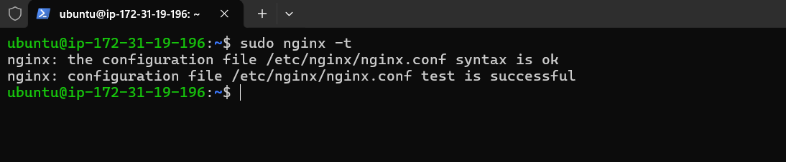

# Documenting the DareyIO LEMP Stack Learning Project

### Setting up my prerequisites - AWS User Account etc

### Setting up a test server on AWS to play with - EC2 t2.micro

### Setting inbound rules to permit ssh, http and https on the EC2 t2.micro

### Connecting to the remote EC2 t2.micro server from my local machine

### Bring the server up to date

### Installing nginx

### Alas prior apache install already locked down port 80 so I verified port 80 was in use with the sudo ss command and then freed up the port by stopping and disabling apache2

### Check that nginx was successfully installed using the systemctl command to start it and check status

### Use curl to view the default index.html file being served up from my localhost / 127.0.0.1:80

### Check that the nginx web server is up and running using http

### Install mysql database server

### Secure mysql database server

### Installing php and other key php modules

### Make a new directory under /var/www for my LEMP Project - critical to grant permissions to the folder (ideally parent) using the chown -R $USER:$USER /var/www cmd

### Setup a basic ServerBlock (VirtualHost in apache2) Config under /etc/nginx/sites-available - this will be a .conf file. Also setup symlinks and other house keeping with '$ sudo ln -s /etc/nginx/sites-available/projectLEMP /etc/nginx/sites-enabled/' and 'sudo unlink /etc/nginx/sites-enabled/default'

### Test that my new site works by editing the /var/www/projectLEMP/index.html file - basically setup a basic static webpage - prettied up the formatting a bit in nano text editor.

### Test that my index.php file at the /var/www/projectLEMP directory works - by default a .html file is loaded ahead of a .php file

### Prepared to integrate php with mysql and serve it up on nginx webserver
**Logged into mysql as root and then created a new DB 'MyTestDB' and new user 'TestDBUser' - weakpassword did not work :)**

**Logged into mysql as 'TestDBUser' and created new table within the DB - ran into some syntax errors with the SQL statements but figured it out**

**Needed to do quite a lot of custom mods to get my php script to work - apparently using special characters '@' & '$' in the TestDBuser password caused trouble - found this out in /var/log/nginx/error.log**
**Did not work!!!**

**Worked!!!** but needed me to relax the password policy with mysql> SET GLOBAL validate_password.policy = 0; after checking the policy in force with mysql> SHOW VARIABLES LIKE 'validate_password%'

##### Needed to associate TestDBUser specifically with localhost and my windows PC IP - need to investigate this further

### Finally success smiled at me after almost 9 hours of struggles :)

