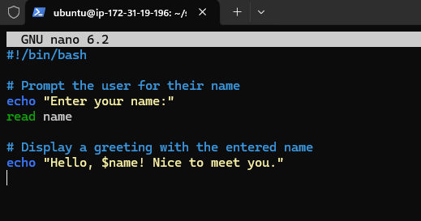
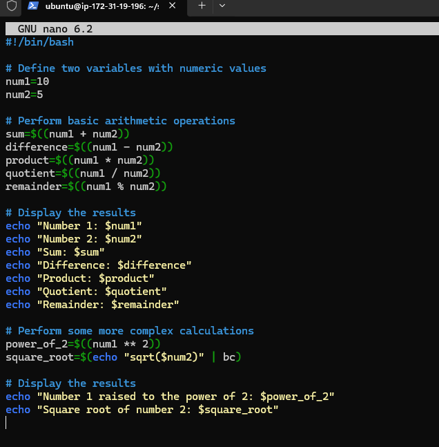

# Documenting the DareyIO Bash Scripting Learning Project

### Getting to know variables, 'echo' and 'read' commands use of '$()' etc

### Learn loops, obtaining user input, dates and date string formatting etc

### Learn File System Navigation, playing with directories and files etc

### Learn math and logical operations etc

### Final project, creating a new directory for backup and moving files to it with a time stamp

