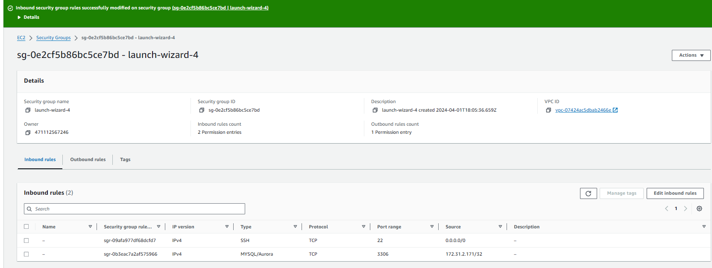

# Documenting the DareyIO Bash Scripting Learning Project

### Prerequisites - set up 2 EC2 instances, one named MySQLClient and another named MySQLServer. MySQLClient will host the SQL client application and perform queries against the MySQLServer machine

### Played with a verbose curl command with -v switch against www.propitixhomes.com just to see one way to obtain the remote server IP and other pertinent info

### Connect to the EC2 PC called MySQLClient, sudo nano /etc/hostname to edit the hostname file to name the PC MySQLClient for readibility and then sudo apt update to refresh the PC to latest software and then sudo apt install mysql-client

### Connect to the EC2 PC called MySQLServer, sudo nano /etc/hostname to edit the hostname file to name the PC MySQLServer for readibility and then sudo apt update to refresh the PC to latest software and then sudo apt install mysql-server

### Prep the EC2 PC called MySQLServer by editing the /etc/mysql/mysql.conf.d/mysqld.cnf to allow any and all IPs using the 0.0.0.0 notation for bind addressrver

### Further prep the EC2 PC called MySQLServer by editing the AWS inbound rules to allow only the specific IP of the MySQLClient to connect on port 3306 (where MySQLServer listens by default). This step hardens security and makes it somewhat harder for unathorised folks to gain access

### Launch mysql on the server computer as root, give a password to the root user and setup database security by running the mysql_secure_installation script that comes bundled with the install

### I chose to weaken security somewhat by setting password length to 6 and allowing simple passwords - this eliminates complexity if I have to use scripts to supply passwords - do not seem to like special characters or perhaps I need to learn how to escape special characters :)

### Create TestDB - noticed this command takes backticks `` and not quotes ''. Create TestDBUser under '%' which I assume allows login as that user from all host PCs. I also created a localhost version of the TestDBUser but later deleted

### Finally, I sshed into the MySQLClient and MySQLServer PCs, setup their windows side by side, used hostname -I command to find the private/local IP of the server and then connected to it from the client as TestDBUser and showed that I could view databases resident on the server with the <SHOW DATABASES;> command as TestDBUser.

